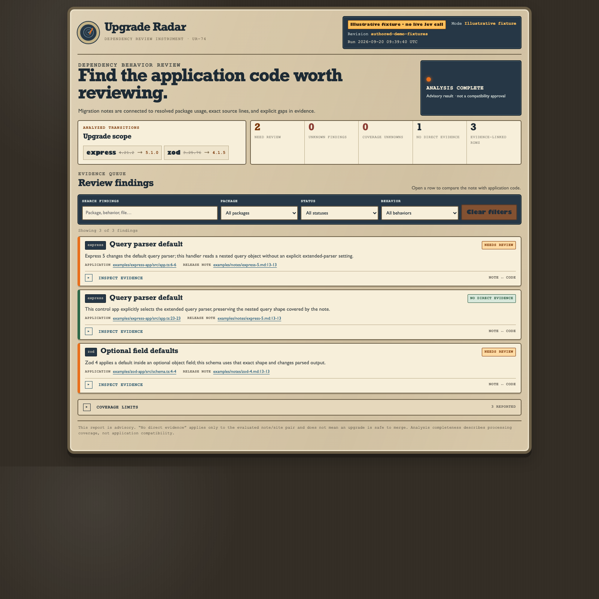

# Upgrade Radar

**The dependency PR changed two lines. Which application behavior changed?**

Upgrade Radar connects reviewed dependency migration notes to the unchanged application code that actually uses the affected package behavior. It returns a short evidence-linked review queue with exact code and note spans, explicit unknowns, and coverage limitations.



The screenshot is generated from the repository's authored no-key demo. It is permanently labeled **ILLUSTRATIVE FIXTURE** and does not represent a live Jev evaluation.

## No-key quickstart

```sh
nvm use
npm ci --ignore-scripts
npm run build
node dist/cli.js demo --out artifacts/demo
open artifacts/demo/report.html
```

The demo shows the concrete Express 4 → 5 query-parser change, an explicit parser-configuration control, and a Zod 3 → 4 optional-default output change.

## Analyze an explicit upgrade

```sh
node dist/cli.js analyze \
  --repo ./examples/express-app \
  --package express --from 4.21.2 --to 5.1.0 \
  --notes ./examples/notes/express-5.md \
  --provider baseline \
  --out artifacts/express
```

Inspect the exact redacted provider payload before a live request:

```sh
node dist/cli.js analyze \
  --repo ./examples/express-app \
  --package express --from 4.21.2 --to 5.1.0 \
  --notes ./examples/notes/express-5.md \
  --provider jev --dry-run
```

Live mode requires `TYPESAFE_API_KEY` in the environment. Missing credentials fail with provider exit code `69`; Upgrade Radar never silently falls back to fixture or baseline decisions.

## Diff two Git revisions

`diff` reads `package.json` and package-lock v2/v3 directly from supplied Git objects, inspects source at `head`, and does not check out or alter the working tree:

```sh
node dist/cli.js diff \
  --repo /path/to/project --base <base-sha> --head <head-sha> \
  --notes-dir /path/to/reviewed-notes \
  --provider baseline --out artifacts/review
```

## Output contract

Every run writes `report.json`, `report.md`, and standalone `report.html`. JSON uses `upgrade-radar-report/v1`. Rows are `review`, `no_direct_evidence`, or `unknown`. `no_direct_evidence` only means the evaluated note/site pair lacks direct evidence; it is never a statement that an upgrade is safe to merge.

Exit codes are stable: `0` completed advisory report, `2` incomplete report, `64` invalid input, and `69` provider failure. Findings alone do not fail a run.

## Supported scope

First-class v0.1 coverage is JavaScript/TypeScript, npm root projects, direct dependencies, package-lock v2/v3, Express **4.21.2 → 5.1.0**, and Zod **3.25.76 → 4.1.5**. Other packages can receive generic usage suggestions without inheriting those coverage claims.

Unsupported or bounded areas stay visible as limitations/unknowns: workspaces, non-npm package managers, transitive-only upgrades, computed imports, unresolved wrappers, full call-graph/dataflow reasoning, incomplete notes, source/candidate caps, and unsupported lockfiles.

## Why the split between code and Jev?

Code owns package identity, versions, source/note spans, hashes, redaction, caps, and citations. The optional Jev adapter receives one compact note/usage pair and answers closed relevance questions. Host code validates the response and maps ambiguity or failures to `unknown`. Jev never generates filenames, line numbers, release facts, citations, patches, or commands.

## GitHub Action

```yaml
- uses: GaneshVG18/upgrade-radar@v0.1.3
  with:
    base: ${{ github.event.pull_request.base.sha }}
    head: ${{ github.event.pull_request.head.sha }}
    notes-dir: reviewed-notes
    provider: baseline
```

The composite Action needs only read access to the checkout. It writes the report to the job summary and uploads an artifact. Do not expose provider keys to untrusted fork PR jobs. See [privacy](docs/privacy.md) for an opt-in trusted live-mode example.

## Evidence and evaluation

`npm run test:compat` executes 48 authored cases across eight documented Express/Zod change families. Every case has an isolated fixture directory with source, reviewed note, case metadata, exact package versions, upstream provenance URL, and SHA-256 entries in `fixtures/manifest.json`. Positive and negative labels come from pinned old/new package behavior; unknown cases state the missing evidence. Robustness variants are marked and are not treated as independent samples. Live Jev evaluation output is intentionally private and is not published as a benchmark.

More detail: [architecture](docs/architecture.md), [limitations](docs/limitations.md), [evaluation](docs/evaluation.md), [privacy](docs/privacy.md), and [comparison](docs/comparison.md).

## Adding a behavior family

Add a short paraphrased reviewed note plus provenance entry, an adapter rule when deterministic syntax is available, executable old/new assertions with controls, unknown cases for unresolved evidence, and unit/integration coverage. Run `npm run notes:manifest`, `npm run corpus:generate` when corpus definitions change, then `npm run check`.

MIT licensed. Upgrade Radar is an advisory compatibility-review tool; it does not replace normal tests or authorize automatic merge decisions.
